# Phase 2 Design: Static Web Application

## Overview

Phase 2 delivers a demo-ready static web application for **MyImpact** that generates culture-aligned goal prompts. The webapp provides a clean UI where users input their context (scale, level, intensity, etc.) and receive high-quality prompts to copy into their LLM of choice.

## Goals

1. **Demonstrate Value**: Show how MyImpact generates context-rich prompts aligned to culture, job levels, and org themes
2. **Prompt-First UX**: Emphasize the "copy to any LLM" workflow (ChatGPT, Claude, Gemini, etc.)
3. **Azure-Hostable**: Deploy as a static site (Azure Static Web Apps preferred) with minimal hosting costs
4. **Foundation for Growth**: Architecture supports future enhancements (LLM integration, persistence, auth)

## Architecture

```mermaid
graph TD
    A["Azure Static Web Apps<br/>(or Blob Storage $web)"]
    B["Static Frontend<br/>HTML/CSS/JavaScript<br/>---<br/>Landing page<br/>Input form<br/>Results display<br/>Copy-to-clipboard<br/>No build step"]
    
    C["🔐 HTTPS"]
    
    D["Azure Container Apps<br/>/ App Service"]
    E["FastAPI Backend<br/>api/main.py<br/>---<br/>GET /api/metadata<br/>POST /api/goals/generate<br/>CORS enabled"]
    
    A --> B
    B -->|HTTPS| C
    C --> D
    D --> E
```



**Separation of Concerns**:
- **Frontend**: Static HTML/CSS/JS hosted cheaply in Azure Static Web Apps
- **Backend**: Existing FastAPI app containerized and deployed separately
- **Communication**: Frontend calls backend API over HTTPS with CORS

## Frontend Components

### Directory Structure

```
webapp/
├── index.html           # Single-page app (landing + form + results)
├── css/
│   └── style.css        # Custom styles (or inline Tailwind)
├── js/
│   ├── app.js           # Main application logic
│   ├── api.js           # API client wrapper
│   └── clipboard.js     # Copy-to-clipboard utilities
└── assets/
    └── logo.svg         # MyImpact branding (optional)
```

### User Interface Sections

#### 1. Landing Section
- **Hero Message**: "Generate Culture-Aligned Career Goals"
- **Value Propositions**:
  - Aligned to level expectations (e.g., something like Radford leveling) (L10–L100+)
  - Reflects your company's cultural principles
  - SMART goals with locus of control
  - Works with any LLM (ChatGPT, Claude, Gemini, etc.)
- **Call-to-Action**: "Get Started" button scrolls to input form

#### 2. Input Form
**Fields**:
- **Scale** (dropdown): Individual Contributor, People Leader
  - Populated dynamically from `GET /api/metadata`
- **Level** (dropdown): L10–15 (Entry), L20–25 (Developing), ...
  - Dynamically filtered based on selected scale
- **Growth Intensity** (radio buttons): Minimal, Moderate, Aggressive
- **Organization** (dropdown): Demo, [future: multiple orgs]
  - Populated from `GET /api/metadata`
- **Theme** (optional text input): Strategic theme to bias generation
  - Future: Could be dropdown from org themes
- **Goal Style** (radio buttons): 
  - Independent (6–9 standalone goals)
  - Progressive (4 quarterly goals building on each other)

**Actions**:
- **Generate Prompt** button: Calls `POST /api/goals/generate`
- Form validation: Ensure required fields are filled

#### 3. Results Display
**System Prompt Section**:
- Collapsible card showing full system prompt
- "Copy System Prompt" button with clipboard icon
- Token count display (optional, for LLM context awareness)

**User Context Section**:
- Collapsible card showing user-specific context
  - Level expectations
  - Cultural attributes for that level
  - Growth intensity guidance
  - Goal style guidance
  - Org themes (if provided)
- "Copy User Context" button with clipboard icon

**Quick Actions**:
- "Copy Both Prompts" button (combines system + user with separator)
- "Start Over" button to reset form and hide results
- Success toast notification after successful copy

**Future Enhancement Placeholders**:
- "Open in ChatGPT" button (grayed out with "Coming Soon" tooltip)
- "Open in Claude" button (grayed out with "Coming Soon" tooltip)

#### 4. Loading & Error States
- **Loading**: Spinner overlay while API call is in progress, disable "Generate" button
- **Error Handling**: 
  - API down: "Service temporarily unavailable. Please try again."
  - Invalid inputs: Inline validation messages
  - Network issues: "Connection error. Check your internet."
  - Server errors: Display user-friendly message with support contact

### User Flow

```
1. User lands on page
   ↓
2. Scrolls/clicks to form
   ↓
3. Selects: Scale → Level → Intensity → Org → Theme (optional) → Goal Style
   ↓
4. Clicks "Generate Prompt"
   ↓
5. Loading spinner appears
   ↓
6. Results display with two collapsible sections
   ↓
7. User clicks "Copy System Prompt" → Toast: "Copied!"
   ↓
8. User clicks "Copy User Context" → Toast: "Copied!"
   ↓
9. User pastes into ChatGPT/Claude/Gemini
   ↓
10. [Optional] User clicks "Start Over" to generate another prompt
```

## Technology Stack

### Frontend

**HTML/CSS/JavaScript Approach**: Vanilla JS (no build step)
- **Rationale**: 
  - Zero build complexity
  - Fast loading (no framework overhead)
  - Easy to host in Azure Static Web Apps or Blob Storage
  - Good enough for Phase 2 demo
- **Future Migration Path**: Can move to Vue/React in Phase 3 if complexity grows

**CSS Framework**: Tailwind CSS via CDN
- **Rationale**:
  - Modern utility-first styling
  - Responsive out-of-the-box
  - No build step when using CDN (`<script src="https://cdn.tailwindcss.com"></script>`)
  - Clean, professional look with minimal custom CSS

**Key Libraries** (all via CDN):
- **Clipboard.js** or native `navigator.clipboard.writeText()` for copy functionality
- **Fetch API** (native) for HTTP requests to backend

### Backend

**Existing FastAPI Application** (`api/main.py`)
- Already implements required endpoints:
  - `GET /api/metadata` → Returns scales, levels, intensities, styles, orgs
  - `POST /api/goals/generate` → Returns (system_prompt, user_context) tuple
- **Required Updates**:
  - Add CORS middleware to allow frontend origin
  - Ensure prompts are returned in JSON-friendly format (strings, not files)
  - Add health check endpoint: `GET /api/health`

**Deployment Target**: Azure Container Apps
- Ability to develop and test locally
- Serverless container hosting
- Pay-per-use pricing
- Auto-scaling for demo traffic
- Easy Docker deployment

## API Integration

### Endpoint: `GET /api/metadata`

**Purpose**: Populate form dropdowns dynamically

**Response Schema**:
```json
{
  "scales": ["technical", "leadership"],
  "levels": {
    "technical": ["L10–15 (Entry)", "L20–25 (Developing)", ...],
    "leadership": ["L70–75 (Director)", "L80–85 (VP)", ...]
  },
  "growth_intensities": ["minimal", "moderate", "aggressive"],
  "goal_styles": ["independent", "progressive"],
  "organizations": ["demo"]
}
```

**Frontend Usage**:
1. Call on page load
2. Populate "Scale" dropdown with `scales` array
3. When scale is selected, populate "Level" dropdown from `levels[selectedScale]`
4. Populate other dropdowns/radio groups from remaining fields

### Endpoint: `POST /api/goals/generate`

**Purpose**: Generate prompts based on user inputs

**Request Schema**:
```json
{
  "scale": "technical",
  "level": "L30–35 (Career)",
  "growth_intensity": "moderate",
  "org": "demo",
  "theme": "Increase Productivity",  // optional
  "goal_style": "independent"
}
```

**Response Schema**:
```json
{
  "inputs": { /* echo of request */ },
  "prompts": [
    "System prompt text here...",
    "User context text here..."
  ],
  "result": null,  // null in prompts-only mode
  "powered_by": "prompts-only"
}
```

**Frontend Usage**:
1. Collect form values
2. Call `POST /api/goals/generate` with JSON payload
3. Display `prompts[0]` as "System Prompt"
4. Display `prompts[1]` as "User Context"
5. Ignore `result` field (only used if Azure OpenAI is configured)

## Hosting Strategy

### Frontend Hosting: Azure Static Web Apps

**Why Azure Static Web Apps**:
- Free tier: 100 GB bandwidth/month, custom domains, automatic HTTPS
- Built-in CI/CD from GitHub (automatic deployments on push)
- Can co-locate API backend (Azure Functions) or use separate API service
- Supports staging environments (branch previews)
- Custom domains and SSL certificates included

**Configuration** (`staticwebapp.config.json`):
```json
{
  "routes": [
    {
      "route": "/api/*",
      "allowedRoles": ["anonymous"]
    }
  ],
  "responseOverrides": {
    "404": {
      "rewrite": "/index.html"
    }
  },
  "navigationFallback": {
    "rewrite": "/index.html"
  }
}
```

**Alternative: Azure Blob Storage ($web container)**
- Cheaper (~$0.10/month) but less feature-rich
- No built-in CI/CD, requires manual uploads
- Good for pure static content, but Static Web Apps is preferred

### Backend Hosting: Azure Container Apps

**Why Azure Container Apps**:
- Serverless containers (pay only for what you use)
- Auto-scaling from 0 to N instances based on traffic
- Built-in HTTPS, load balancing, health probes
- Easy Docker deployment (no Kubernetes complexity)
- Cost-effective for demo/low-traffic scenarios

**Dockerfile Requirements**:
- Base image: `python:3.12-slim`
- Install myimpact package and API dependencies
- Include data files (`data/`, `prompts/`)
- Expose port 80
- Start Uvicorn server

**Alternative: Azure App Service (Linux)**
- Traditional PaaS, always-on pricing
- More expensive but simpler for production workloads
- Consider for Phase 3+ if traffic is consistent

## CORS Configuration

Update `api/main.py` to allow frontend origin:

```python
from fastapi.middleware.cors import CORSMiddleware

app.add_middleware(
    CORSMiddleware,
    allow_origins=[
        "https://myimpact-demo.azurestaticapps.net",  # Production
        "https://*.azurestaticapps.net",               # Branch previews
        "http://localhost:8080",                       # Local dev
    ],
    allow_credentials=True,
    allow_methods=["GET", "POST", "OPTIONS"],
    allow_headers=["*"],
)
```

## Feature Scope

### Phase 2 Must-Have (MVP Demo)

**Landing Page**:
- ✅ Hero section with clear value proposition
- ✅ Benefits list (job level aligned, culture-aware, LLM-agnostic)
- ✅ Call-to-action button

**Input Form**:
- ✅ All 6 input parameters with proper UI controls
- ✅ Dynamic dropdown population from `/api/metadata`
- ✅ Form validation (required fields)
- ✅ Clear labels and help text

**Prompt Generation**:
- ✅ "Generate Prompt" button calls backend API
- ✅ Loading spinner during API call
- ✅ Display system prompt in collapsible card
- ✅ Display user context in collapsible card

**Copy to Clipboard**:
- ✅ "Copy System Prompt" button
- ✅ "Copy User Context" button
- ✅ "Copy Both Prompts" button (combined)
- ✅ Success notification after copy

**Error Handling**:
- ✅ API errors displayed user-friendly
- ✅ Network issues handled gracefully
- ✅ Form validation errors inline

**Responsive Design**:
- ✅ Mobile-friendly layout (works on phones/tablets)
- ✅ Desktop optimized (wider screens)

**Azure Deployment**:
- ✅ Frontend hosted in Azure Static Web Apps
- ✅ Backend API containerized and deployed to Azure Container Apps
- ✅ HTTPS enabled, custom domain (optional)

### Phase 2 Nice-to-Have (Polish)

**UX Enhancements**:
- 🔲 Collapsible sections for prompts (start collapsed, expand on demand)
- 🔲 "Example" button to pre-fill form with demo values
- 🔲 "Start Over" button to reset form and hide results
- 🔲 Toast notifications for all user actions (copy success, errors)
- 🔲 URL parameter support for sharing (e.g., `?scale=technical&level=L30`)

**Analytics**:
- 🔲 Azure Application Insights integration
- 🔲 Track: page views, form submissions, copy events
- 🔲 Error tracking and monitoring

**Performance**:
- 🔲 Lazy loading for below-the-fold content
- 🔲 Minified CSS/JS (if moving away from CDNs)
- 🔲 Image optimization for assets

### Future Phases (Not Phase 2)

**Phase 3: Optional LLM Integration**
- 🔮 "Open in ChatGPT" button (uses ChatGPT share API or pre-fills)
- 🔮 "Open in Claude" button
- 🔮 "Generate with Azure OpenAI" button (if user provides API key)

**Phase 3: Personalization & History**
- 🔮 OAuth login (Azure AD B2C)
- 🔮 Save/load previous prompts (requires Cosmos DB)
- 🔮 User preferences (default scale, level, org)

**Phase 4: Admin Features**
- 🔮 Admin UI for editing culture CSVs (rich text editor)
- 🔮 Admin UI for managing org themes (markdown editor)
- 🔮 Preview changes before publishing
- 🔮 Multi-tenant governance (different orgs see different themes)

## Success Metrics (Demo)

### Functionality
- ✅ All 6 input parameters work correctly
- ✅ Prompts generate successfully for all valid combinations
- ✅ Copy-to-clipboard works in Chrome, Edge, Firefox, Safari

### Performance
- ✅ Page load: < 2 seconds on 3G connection
- ✅ API response: < 1 second for prompt generation
- ✅ Total time from click to displayed prompts: < 2 seconds

### User Experience
- ✅ Form is intuitive (no instructions needed for basic use)
- ✅ Copy buttons have clear visual feedback (icon change, toast)
- ✅ Mobile usable (tested on phone and tablet)

### Reliability
- ✅ API uptime: > 99% during demo period
- ✅ Error messages are helpful and actionable
- ✅ No JavaScript console errors

### Accessibility
- 🔲 Keyboard navigable (tab through form, enter to submit)
- 🔲 Screen reader friendly (ARIA labels on interactive elements)
- 🔲 Color contrast meets WCAG AA standards

## Design Principles

1. **Prompt-First Mindset**: The webapp's job is to generate great prompts, not to replace LLMs
2. **Simplicity Over Features**: Resist feature creep in Phase 2—focus on core workflow
3. **Azure-Native**: Use Azure services where they make sense, but avoid lock-in
4. **Mobile-Friendly**: Majority of users may access from phones—design mobile-first
5. **Future-Proof**: Architecture should support Phase 3 enhancements (auth, LLM integration, history)

## Open Questions

1. **Custom Domain**: Do we want a custom domain (e.g., `myimpact.example.com`) or use Azure default (`myimpact-demo.azurestaticapps.net`)?
2. **Branding**: Logo, color scheme, typography—use company brand or create custom MyImpact identity?
3. **Analytics**: What metrics matter most for demo feedback? (form submissions, copy events, error rates?)
4. **Multi-Org**: Phase 2 will have "demo" org only—when do we add multiple orgs?
5. **LLM Integration Timing**: If demo gets positive feedback, do we fast-track "Open in ChatGPT" buttons or wait for Phase 3?

## Risks & Mitigations

| Risk | Impact | Mitigation |
|------|--------|------------|
| API downtime during demo | High | Deploy with health checks, monitoring, auto-restart |
| CORS issues preventing frontend from calling API | High | Test CORS thoroughly in staging environment |
| Mobile UX is poor (small screens) | Medium | Design mobile-first, test on real devices |
| Copy-to-clipboard fails in some browsers | Medium | Use polyfill, fall back to "select text" prompt |
| Azure costs exceed budget | Low | Use Free Tier for Static Web Apps, monitor Container Apps usage |

## Deliverables

1. **Frontend Code**: `webapp/` directory with HTML, CSS, JS
2. **Backend Updates**: CORS middleware, health check endpoint
3. **Dockerfile**: For containerizing FastAPI app
4. **Deployment Config**: `staticwebapp.config.json`, environment variable docs
5. **User Documentation**: Simple "How to Use" guide on landing page
6. **Demo Script**: Step-by-step walkthrough for presenting to stakeholders

## Alignment with Long-Term Vision

Phase 2 is designed to validate the **prompt-first approach** while maintaining flexibility for future enhancements:

- **Today**: Users copy prompts → paste into any LLM → get goals
- **Phase 3**: Users can optionally click "Open in ChatGPT" → pre-filled chat → one-click generation
- **Phase 4**: Users can log in → see history → iterate on prompts → save favorites

The static web app architecture supports all of these evolution paths without requiring a full rewrite.
