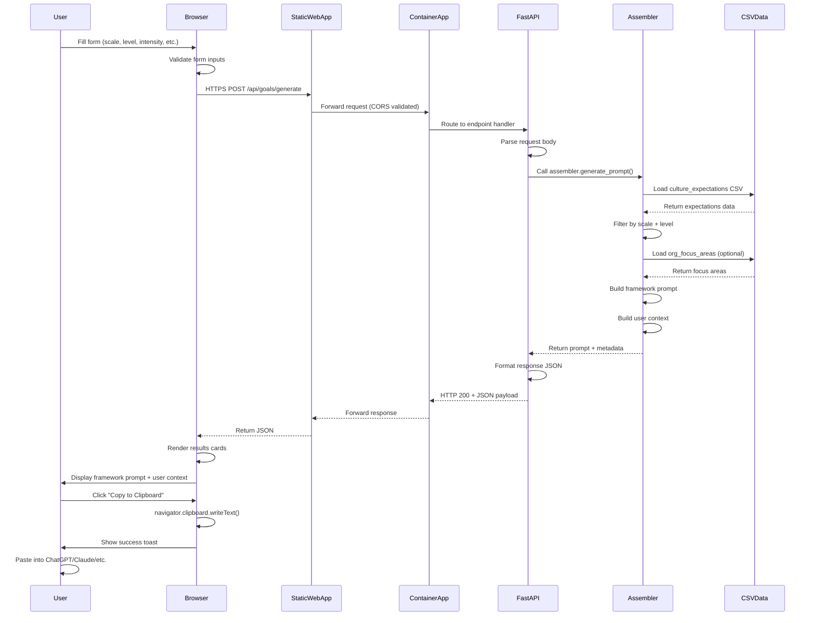

# Data Flow Architecture

This document describes how data flows through the MyImpact system for the core use case: generating culture-aligned career goal prompts.

## End-to-End Data Flow
    


## Request Flow Details

### 1. Form Submission

**Input Data:**
```json
{
  "scale": "Technical",
  "level": "L30",
  "growth_intensity": "Moderate",
  "organization": "Demo",
  "focus_area": "Platform Engineering",
  "goal_style": "Independent"
}
```

**Validation:**
- Required fields: scale, level, growth_intensity, organization, goal_style
- Optional fields: focus_area
- Client-side: JavaScript validates before submission
- Server-side: FastAPI Pydantic models validate schema

**Error Handling:**
- 400 Bad Request: Missing required fields or invalid enum values
- 404 Not Found: Unknown organization or level not found in data
- 500 Internal Server Error: Data loading or processing errors

### 2. Backend Processing

**Data Loading:**
```python
# Load culture expectations CSV
df = pd.read_csv('data/culture_expectations_individual_contributor_technical.csv')

# Filter by scale and level
level_data = df[(df['Scale'] == scale) & (df['Level'] == level)]

# Extract expectations
expectations = {
    'strategic_thinking': level_data['Strategic_Thinking'].values[0],
    'execution_delivery': level_data['Execution_Delivery'].values[0],
    'collaboration_influence': level_data['Collaboration_Influence'].values[0],
    'innovation_learning': level_data['Innovation_Learning'].values[0]
}
```

**Prompt Assembly:**
1. Load framework prompt template from `prompts/goal_generation_framework_prompt.txt`
2. Load organization focus areas from `prompts/org_focus_areas_demo.md`
3. Inject level expectations into user context
4. Inject growth intensity guidance
5. Inject goal style (independent vs progressive)
6. Return structured response

### 3. Response Structure

**Success Response (200 OK):**
```json
{
  "framework_prompt": "# Goal Generation Framework\n\n...",
  "user_context": "## Your Context\n\n**Job Level:** L30 (Career Level)\n...",
  "metadata": {
    "organization": "Demo",
    "scale": "Technical",
    "level": "L30",
    "growth_intensity": "Moderate",
    "goal_style": "Independent"
  }
}
```

**Error Response (4xx/5xx):**
```json
{
  "detail": "Level L99 not found for scale Technical"
}
```

## Data Sources

### Culture Expectations CSV

**Location:** `data/culture_expectations_individual_contributor_technical.csv`

**Schema:**
- Scale (Technical, Leadership)
- Level (L10-L15, L20-L25, L30-L35, etc.)
- Strategic_Thinking (text description)
- Execution_Delivery (text description)
- Collaboration_Influence (text description)
- Innovation_Learning (text description)

**Access Pattern:** 
- Read-only
- Loaded on demand (no caching in demo)
- Future: Cache in memory for performance

### Framework Prompt Template

**Location:** `prompts/goal_generation_framework_prompt.txt`

**Content:**
- SMART goal framework
- Locus of control principles
- Cultural alignment guidance
- Output format instructions

**Access Pattern:**
- Read-only
- Loaded on demand
- Static content (no variables)

### Organization Focus Areas

**Location:** `prompts/org_focus_areas_demo.md`

**Content:**
- Strategic initiatives
- Current priorities
- Technology focus
- Business objectives

**Access Pattern:**
- Read-only
- Loaded if organization specified
- Future: Support multiple org files

## Performance Characteristics

**Target Latency (P95):**
- Form submission to response: ≤ 3 seconds
- Metadata endpoints: ≤ 1 second

**Current Implementation:**
- No caching (demo simplicity)
- CSV loaded per request
- Single-threaded processing

**Future Optimizations:**
- In-memory CSV caching (reduces disk I/O)
- Async file loading
- Response compression (gzip)
- CDN for static prompt templates

## Security Controls

**Data in Transit:**
- HTTPS only (enforced by Azure Static Web Apps and Container Apps)
- TLS 1.2+ minimum
- CORS headers restrict origins

**Data at Rest:**
- No user data persisted
- Culture expectations CSV in container image (read-only)
- No secrets in data files

**Input Validation:**
- Client-side: JavaScript form validation
- Server-side: FastAPI Pydantic models
- Enum validation for scale, level, intensity, goal_style

**Rate Limiting:**
- Azure Container Apps: Default connection limits
- Future: Implement explicit rate limiting (10 req/min per IP)

## Monitoring Points

**Key Metrics:**
- Request latency (P50, P95, P99)
- Error rate (4xx, 5xx)
- CSV load time
- Prompt assembly time

**Health Checks:**
- GET /api/health (readiness probe)
- Returns 200 OK if app is healthy
- Checks: CSV files readable, framework prompt accessible

**Logging:**
- Request/response pairs (correlation ID)
- Error traces with stack dumps
- Performance timing (CSV load, assembly, total)

**Future: Application Insights**
- Distributed tracing
- Custom metrics
- Alerting on error rate spikes
