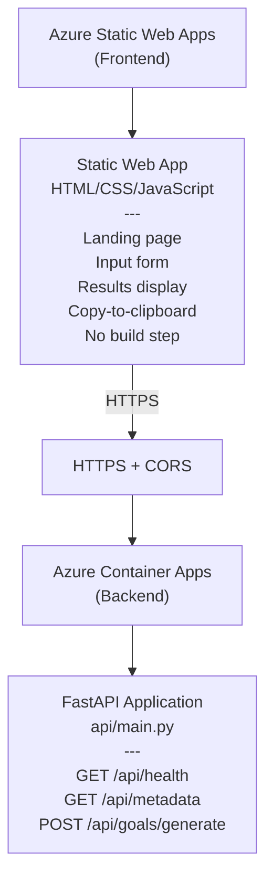

# Architecture Overview

Complete system architecture for MyImpact Phase 2.

## Architecture Documentation

This overview provides a high-level summary. For detailed information, see:

- **[System Overview](system-overview.md)** - Components, interactions, deployment architecture
- **[Data Flow](data-flow.md)** - End-to-end data flow, request/response lifecycle
- **[Security Design](security-design.md)** - Security architecture aligned with Azure Well-Architected Framework

## High-Level Design



**Key Principle**: Separation of concerns
- **Frontend**: Lightweight static site (no server-side rendering)
- **Backend**: Python FastAPI application (containerized)
- **Communication**: HTTPS with CORS headers

## Goals & Principles

1. **Demonstrate Value**: Show how MyImpact generates context-rich prompts aligned to culture, job levels, and org focus areas
2. **Prompt-First UX**: Emphasize the "copy to any LLM" workflow (ChatGPT, Claude, Gemini, etc.)
3. **Azure-Hostable**: Deploy as static + containerized with minimal hosting costs (approximately $15/month)
4. **Foundation for Growth**: Architecture supports future enhancements (LLM integration, persistence, auth)

---

## Frontend Architecture

### Technology Stack

**HTML/CSS/JavaScript** (Vanilla, no build step)
- **Why**: Zero build complexity, fast loading, easy to host in Static Web Apps
- **CSS**: Tailwind CSS via CDN (`<script src="https://cdn.tailwindcss.com"></script>`)
- **HTTP**: Fetch API (native)
- **Clipboard**: `navigator.clipboard.writeText()` (native)

### Directory Structure

```
webapp/
├── index.html           # Single-page app (landing + form + results)
├── staticwebapp.config.json  # SWA routing configuration
├── css/
│   └── (inline Tailwind via CDN)
└── js/
    ├── app.js           # Main application logic
    └── api.js           # API client wrapper
```

### User Interface

#### Landing Section
- Hero message: "Generate Culture-Aligned Career Goals"
- Value propositions:
  - Aligned to job level expectations
  - Reflects company cultural principles
  - SMART goals with locus of control
  - Works with any LLM (ChatGPT, Claude, Gemini, etc.)
- Call-to-action button scrolls to form

#### Input Form
**Fields**:
- **Scale** (dropdown): Technical, Leadership
- **Level** (dropdown): L10–15 (Entry), L20–25 (Developing), L30–35 (Career), etc.
- **Growth Intensity** (radio): Minimal, Moderate, Aggressive
- **Organization** (dropdown): Demo
- **Focus Area** (optional): Strategic focus area for goal generation
- **Goal Style** (radio): Independent (6–9 standalone goals) or Progressive (4 quarterly goals)

**Actions**:
- "Generate Prompt" button → Calls API
- Form validation ensures required fields filled

#### Results Display
**Framework Prompt Card**:
- Collapsible card showing full framework prompt
- "Copy Framework Prompt" button with clipboard icon
- Token count (optional)

**User Context Card**:
- Level expectations
- Cultural attributes for that level
- Growth intensity guidance
- Goal style guidance
- Org focus areas
- "Copy User Context" button

**Quick Actions**:
- "Copy Prompts" button (combines with separator)
- "Start Over" button (resets form)
- Toast notifications on successful copy

#### Loading & Error States
- **Loading**: Spinner overlay, disable Generate button
- **Error**: User-friendly messages for API down, network issues, validation errors

### User Flow

```
1. Land on page
2. Scroll to form section
3. Select Scale → Level → Intensity → Org → Focus Area (optional) → Goal Style
4. Click "Generate Prompt"
5. API call (loading spinner)
6. Results display with two collapsible sections
7. Click "Copy Framework Prompt" → Toast: "Copied!"
8. Click "Copy User Context" → Toast: "Copied!"
9. Paste into ChatGPT/Claude/Gemini
10. (Optional) "Start Over" to generate another prompt
```

---

## Backend Architecture

### Technology Stack

**FastAPI** (Python web framework)
- **Why**: Fast, async-friendly, automatic OpenAPI documentation, type hints
- **ASGI Server**: Uvicorn (production-ready)
- **Dependencies**: See `pyproject.toml` for full list

**Package Structure**:
```
myimpact/
├── __init__.py
├── assembler.py         # Prompt generation logic
└── cli.py               # Command-line interface

api/
└── main.py              # FastAPI application

data/
├── culture_expectations_leadership.csv
└── culture_expectations_technical.csv

prompts/
└── goal_generation_framework_prompt.txt
```

### API Endpoints

#### `GET /api/health`
**Purpose**: Health check for load balancers

**Response** (200 OK):
```json
{
  "status": "healthy",
  "version": "0.1.0"
}
```

---

#### `GET /api/metadata`
**Purpose**: Populate form dropdowns dynamically

**Response** (200 OK):
```json
{
  "scales": ["technical", "leadership"],
  "levels": {
    "technical": ["L10–15 (Entry)", "L20–25 (Developing)", "L30–35 (Career)", ...],
    "leadership": ["L70–75 (Director)", "L80–85 (VP)", ...]
  },
  "growth_intensities": ["minimal", "moderate", "aggressive"],
  "goal_styles": ["independent", "progressive"],
  "organizations": ["demo"]
}
```

**Frontend Usage**:
1. Call on page load
2. Populate "Scale" dropdown with `scales` array
3. When scale selected, filter "Level" dropdown from `levels[selectedScale]`
4. Populate other dropdowns/radio groups from remaining fields

---

#### `POST /api/goals/generate`
**Purpose**: Generate prompts based on user inputs

**Request**:
```json
{
  "scale": "technical",
  "level": "L30–35 (Career)",
  "growth_intensity": "moderate",
  "org": "demo",
  "focus_area": "Increase Productivity",  // optional
  "goal_style": "independent"
}
```

**Response** (200 OK):
```json
{
  "inputs": { /* echo of request */ },
  "prompts": [
    "You are a goal generation system...",  // Framework prompt
    "Generate 6-9 SMART goals..."           // User context
  ],
  "result": null,
  "powered_by": "prompts-only"
}
```

**Error Responses**:
- 400 Bad Request: Invalid scale, level, intensity, etc.
- 500 Internal Server Error: Unexpected exception

---

### Data Model

#### Scales
Two primary scales:
- **Technical**: Individual contributors on technical track (L10–35+)
- **Leadership**: People managers and leaders (L70–100+)

#### Levels
Job leveling system:
- **Technical Track**: L10–L35+ (10-year spans: Entry → Mid → Senior → Principal)
- **Leadership Track**: L70–L100+ (10-year spans: Director → VP → C-Suite)

#### Growth Intensities
- **Minimal**: 1–2 foundational goals, slow burn
- **Moderate**: 3–4 balanced goals, steady growth
- **Aggressive**: 5–6 ambitious goals, push development

#### Goal Styles
- **Independent**: 6–9 standalone goals (can be done in any order)
- **Progressive**: 4 quarterly goals building on each other

#### Organizations
Currently:
- **demo**: Default org with predefined culture expectations

Future:
- Multi-tenant support with custom cultures

---

## Data Sources

### Culture Expectations
Two CSV files define expectations for each scale/level:

**`data/culture_expectations_technical.csv`**
- Columns: `level`, `expectation` (cultural attribute)
- Example: L30–35, "Mentors others, advocates for technical excellence"

**`data/culture_expectations_leadership.csv`**
- Columns: `level`, `expectation` (cultural attribute)
- Example: L80–85, "Strategic vision, drives organizational change"

### Goal Generation Prompt
**`prompts/goal_generation_framework_prompt.txt`**
- Base system prompt for LLM-powered generation
- Can be extended with org focus areas for customization

---

## Deployment Architecture

### Frontend: Azure Static Web Apps

**Why Azure Static Web Apps**:
- Free tier: 100 GB bandwidth/month
- Built-in CI/CD from GitHub (auto-deploy on push)
- Custom domains + HTTPS included
- Automatic global distribution via CDN

**Configuration**:
```json
// staticwebapp.config.json
{
  "routes": [
    { "route": "/api/*", "allowedRoles": ["anonymous"] }
  ],
  "responseOverrides": {
    "404": { "rewrite": "/index.html" }
  }
}
```

**Deployment Flow**:
1. Push to GitHub `main` branch
2. GitHub Actions workflow triggers
3. Builds and deploys `webapp/` directory
4. Available at: `https://<static-app-name>.azurestaticapps.net`

---

### Backend: Azure Container Apps

**Why Azure Container Apps**:
- Serverless containers (pay-per-use)
- Auto-scaling from 0 to N instances
- Built-in HTTPS, load balancing, health probes
- Cost-effective for demo scenarios (~$15/month)

**Deployment Flow**:
1. Build Docker image locally or in CI/CD
2. Push to Azure Container Registry
3. Deploy to Container Apps environment
4. Auto-scalable, always-on endpoint at `https://<app-name>.azurecontainerapps.io`

**Docker Configuration**:
- Base image: `python:3.12-slim`
- Copy package files + data + prompts
- Install dependencies
- Expose port 8000
- Run: `uvicorn api.main:app --host 0.0.0.0 --port 8000`

---

## CORS Configuration

**Why CORS is needed**:
Frontend (Static Web Apps domain) calls backend (Container Apps domain) = cross-origin request

**Backend Configuration** (`api/main.py`):
```python
from fastapi.middleware.cors import CORSMiddleware

app.add_middleware(
    CORSMiddleware,
    allow_origins=[
        "http://localhost:3000",      # Local frontend (npm)
        "http://localhost:8080",      # Local frontend (http.server)
        "http://localhost:5173",      # Local Vite dev server
        "https://*.azurestaticapps.net",  # Production
    ],
    allow_credentials=True,
    allow_methods=["*"],
    allow_headers=["*"],
)
```

---

## Security Considerations

**Frontend (Static Content)**:
- No secrets stored in code (all frontend config is public)
- API endpoint URL is public (no auth required for MVP)
- Future: Add authentication for user data persistence

**Backend (API Service)**:
- CORS restricts which origins can call API
- Input validation on all POST endpoints
- No secrets hardcoded (use environment variables)
- Docker runs as non-root user (security best practice)

**HTTPS**:
- All communication encrypted end-to-end
- Static Web Apps + Container Apps both auto-issue SSL certs

---

## Scaling & Future Enhancements

### Phase 3+

**LLM Integration**:
- Store Azure OpenAI credentials securely (Key Vault)
- Add authentication layer (JWT, Entra ID)
- Cache generated goals

**Data Persistence**:
- Add database (Cosmos DB, PostgreSQL) to store:
  - User-generated goals
  - Prompt history
  - Usage analytics
- Add `POST /api/goals/save` endpoint

**Multi-Tenancy**:
- Support multiple organizations with custom cultures
- Add `GET /api/orgs` and `POST /api/orgs` endpoints

**Real-Time Collaboration**:
- WebSocket support for live goal editing
- Team goal alignment dashboards

---

## Cost Analysis

| Component | Free Tier | Monthly Cost | Notes |
|-----------|-----------|--------------|-------|
| Static Web Apps | ✅ 100 GB BW | $0 | Free tier sufficient |
| Container Apps | 0.5 CPU, 1 GB | ~$15 | Pay-per-use, scales to zero |
| Container Registry | | ~$5 | Standard tier |
| **Total** | | **~$20/month** | Low cost for demo |

**Cost Optimization**:
- Set min replicas to 0 for auto-scale to zero (cold-start ~5 sec)
- Compress images and assets on frontend

---

## Performance Metrics

### Frontend
- Time to Interactive (TTI): < 2 seconds
- First Contentful Paint (FCP): < 1 second
- Lighthouse Score: 90+

### Backend
- API Response Time: < 500ms (for metadata, prompt generation)
- Concurrent Users: 100+ (with auto-scaling)

---

## Monitoring & Observability

### Frontend
- Google Analytics (optional, for usage tracking)
- Browser console for error tracking

### Backend
- Azure Application Insights (logs, metrics, traces)
- Container Apps metrics (CPU, memory, request count)

---

## Summary

MyImpact Phase 2 is a lightweight, cost-effective system for demonstrating prompt generation capabilities. The static frontend + containerized backend architecture provides a solid foundation for future growth while keeping operational complexity and costs minimal.

→ Ready to deploy? See [03-deployment.md](03-deployment.md)

→ Want to develop locally? See [02-local-development.md](02-local-development.md)
