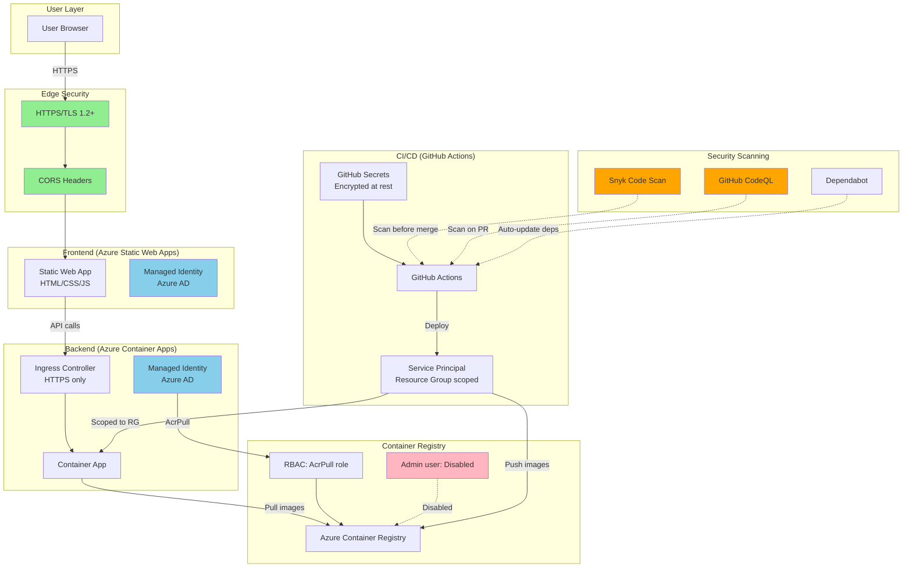

# Security Design

This document describes the security architecture for MyImpact, aligned with the Azure Well-Architected Framework Security pillar.

## Security Principles

1. **Defense in Depth:** Multiple layers of security controls
2. **Least Privilege:** Minimal permissions for all identities
3. **Zero Trust:** Verify explicitly, use least privilege access, assume breach
4. **Security at Inception:** Security scanned before deployment (Snyk)
5. **No Secrets in Code:** All credentials in GitHub Secrets or Managed Identity

## Threat Model

### Assets to Protect

| Asset | Sensitivity | Threat |
|-------|-------------|--------|
| Culture expectations data | Low (internal culture docs) | Unauthorized access, tampering |
| Framework prompts | Low (methodology) | Intellectual property theft |
| User form inputs | Medium (career level, focus areas) | Data leakage, manipulation |
| Azure credentials | High (infrastructure access) | Credential theft, privilege escalation |
| Container images | Medium (application code) | Supply chain attacks, malicious code injection |

### Attack Vectors

1. **Compromised GitHub Secret:** Service principal credentials leaked
2. **Container Image Tampering:** Malicious code injected during build
3. **API Abuse:** Excessive requests, malformed inputs
4. **Man-in-the-Middle:** HTTPS downgrade or certificate attacks
5. **Dependency Vulnerabilities:** Known CVEs in Python packages or base images

## Security Architecture



## Security Controls by Layer

### 1. Network Security

**Azure Static Web Apps (Frontend)**
- HTTPS enforced (HTTP redirects to HTTPS)
- TLS 1.2+ minimum
- Azure CDN for DDoS protection
- Custom domain with Azure-managed certificates (future)

**Azure Container Apps (Backend)**
- Ingress: HTTPS only, no HTTP endpoint
- CORS headers restrict allowed origins:
  ```json
  {
    "allowedOrigins": ["https://your-static-web-app.azurestaticapps.net"],
    "allowedMethods": ["GET", "POST"],
    "allowedHeaders": ["Content-Type"]
  }
  ```
- Virtual network integration (future: private VNET)

**Firewall Rules**
- Container Apps Environment: Public ingress (demo), private ingress (prod)
- Container Registry: Public access (demo), private endpoint (prod)

### 2. Identity and Access Management

**Managed Identity (Preferred)**

Container Apps use Azure AD Managed Identity to access Container Registry:
```bicep
resource containerApp 'Microsoft.App/containerApps@2023-05-01' = {
  identity: {
    type: 'SystemAssigned'
  }
}

// Role assignment: AcrPull on Container Registry
resource acrPullRole 'Microsoft.Authorization/roleAssignments@2022-04-01' = {
  scope: containerRegistry
  properties: {
    principalId: containerApp.identity.principalId
    roleDefinitionId: subscriptionResourceId('Microsoft.Authorization/roleDefinitions', '7f951dda-4ed3-4680-a7ca-43fe172d538d')
  }
}
```

**Benefits:**
- No credentials to manage or rotate
- Automatic token renewal
- Auditable via Azure AD logs
- Cannot be leaked (tied to Azure resource)

**Service Principal (CI/CD only)**

GitHub Actions use Service Principal with scoped permissions:
- **Scope:** Resource group only (not subscription-wide)
- **Role:** Contributor (minimum required for container app updates)
- **Rotation:** Credentials expire after 1 year (manual renewal required)

**Secret stored in GitHub Secrets:**
```json
{
  "clientId": "xxxxx",
  "clientSecret": "xxxxx",
  "tenantId": "xxxxx",
  "subscriptionId": "xxxxx"
}
```

**Future: Federated Credentials (OIDC)**
- No client secret (GitHub OIDC token used instead)
- Short-lived tokens (minutes, not years)
- Automatic rotation

### 3. Container Security

**Azure Container Registry (ACR)**
- Admin user: **Disabled** (prevent credential-based access)
- Image scanning: Azure Defender for Containers (optional)
- Content trust: Notary v2 (future: signed images)
- Quarantine pattern: Untrusted images isolated until scanned

**Container Images**
- Base image: `python:3.11-slim` (official, minimal attack surface)
- Multi-stage build: Build artifacts not in final image
- Non-root user: Container runs as unprivileged user
- Image tagging: Git commit SHA (not `latest`, enables rollback)

**Dockerfile security:**
```dockerfile
FROM python:3.11-slim

# Create non-root user
RUN useradd -m -u 1000 appuser

# Install dependencies as root
COPY requirements.txt .
RUN pip install --no-cache-dir -r requirements.txt

# Copy application as non-root user
COPY --chown=appuser:appuser . /app
WORKDIR /app

# Run as non-root
USER appuser
CMD ["uvicorn", "api.main:app", "--host", "0.0.0.0", "--port", "8000"]
```

### 4. Application Security

**Input Validation**
- Client-side: JavaScript form validation (user experience)
- Server-side: FastAPI Pydantic models (security enforcement)
- Enum validation: Scale, level, growth_intensity, goal_style
- Length limits: Focus area (max 200 chars)

**Output Encoding**
- JSON responses properly escaped (FastAPI automatic)
- HTML characters sanitized in frontend (Tailwind CSS escapes)

**Dependency Management**
- Snyk scans Python dependencies for known CVEs
- Dependabot auto-updates to patched versions
- `pyproject.toml` pins major versions, allows minor/patch updates

**Rate Limiting**
- Current: Azure Container Apps default connection limits
- Future: Explicit rate limiting (10 req/min per IP, 100 req/hour per IP)

### 5. Data Protection

**Data at Rest**
- No user data persisted (stateless application)
- Culture expectations CSV in container image (public data, no encryption needed)
- Logs: Azure Container Apps logs (encrypted at rest by Azure)

**Data in Transit**
- HTTPS/TLS 1.2+ for all communication
- Certificate: Azure-managed (auto-renewal)
- Cipher suites: Modern, forward secrecy enabled

**Data Classification**
| Data Type | Classification | Encryption | Retention |
|-----------|----------------|------------|-----------|
| Form inputs | Internal | TLS in transit | None (not persisted) |
| Culture expectations | Public | None | Indefinite (in source control) |
| Application logs | Internal | Azure-managed | 30 days |
| GitHub Secrets | Confidential | GitHub-managed | Indefinite |

### 6. CI/CD Security

**GitHub Actions Workflow Security**
- Runs on GitHub-hosted runners (isolated VMs)
- Service Principal credentials in GitHub Secrets (encrypted at rest)
- Secrets not exposed in logs (GitHub automatic masking)
- Pull request workflows: No secrets access (untrusted code cannot read secrets)

**Build Pipeline Security**
1. **Code Scanning:** GitHub CodeQL analyzes Python code for vulnerabilities
2. **Dependency Scanning:** Snyk checks `requirements.txt` for known CVEs
3. **Build:** Docker builds image with commit SHA tag
4. **Push:** Image pushed to ACR (authenticated with Service Principal)
5. **Deploy:** Container App updated with new image (health check validates)

**Supply Chain Security**
- Base images from Docker Official Images (verified publisher)
- Python packages from PyPI (checksum verification)
- No binary dependencies from untrusted sources

### 7. Monitoring and Detection

**Security Logging**
- Azure Container Apps: Application logs, system logs
- Azure AD: Sign-in logs, audit logs (Managed Identity usage)
- GitHub: Workflow logs, secret access logs

**Alerting (Future)**
- Failed authentication attempts (Azure AD)
- Unauthorized API access (4xx errors)
- Container restart loops (reliability issue, possible attack)
- High error rate (500 errors)

**Incident Response**
- Rotate GitHub Secrets: Regenerate Service Principal credentials
- Rollback: Deploy previous image version (Git commit SHA)
- Quarantine: Disable compromised Container App, investigate logs

## Compliance Considerations

**GDPR/Privacy**
- No personally identifiable information (PII) collected
- No cookies or tracking
- User inputs not stored

**SOC 2 / ISO 27001 (Future)**
- Audit logs enabled (Azure AD, Container Apps)
- Role-based access control (RBAC)
- Secrets management (GitHub Secrets, Key Vault)
- Encryption in transit (HTTPS/TLS)

## Security Testing

**Automated Scanning**
- GitHub CodeQL: Weekly scans, PR scans
- Snyk: Daily scans, PR scans
- Dependabot: Daily dependency checks

**Manual Testing (Recommended)**
- OWASP ZAP: API security testing
- Burp Suite: HTTP intercept testing
- Load testing: Identify DoS thresholds

## Security Roadmap

**Phase 1 (Current):**
- Service Principal with resource group scope
- Managed Identity for Container App → ACR
- HTTPS enforced
- Snyk/CodeQL scanning

**Phase 2 (Production-ready):**
- Federated credentials (OIDC) for GitHub Actions
- Azure Key Vault for secrets management
- Private endpoints for ACR and Container Apps
- Web Application Firewall (WAF)

**Phase 3 (Enterprise-ready):**
- Azure AD authentication for frontend
- Role-based access to features
- Audit logging to Azure Monitor
- Security Information and Event Management (SIEM) integration
- Penetration testing by third party

## References

- [Azure Well-Architected Framework: Security](https://learn.microsoft.com/azure/well-architected/security/)
- [OWASP Top 10](https://owasp.org/www-project-top-ten/)
- [CIS Docker Benchmark](https://www.cisecurity.org/benchmark/docker)
- [GitHub Security Best Practices](https://docs.github.com/en/code-security)
