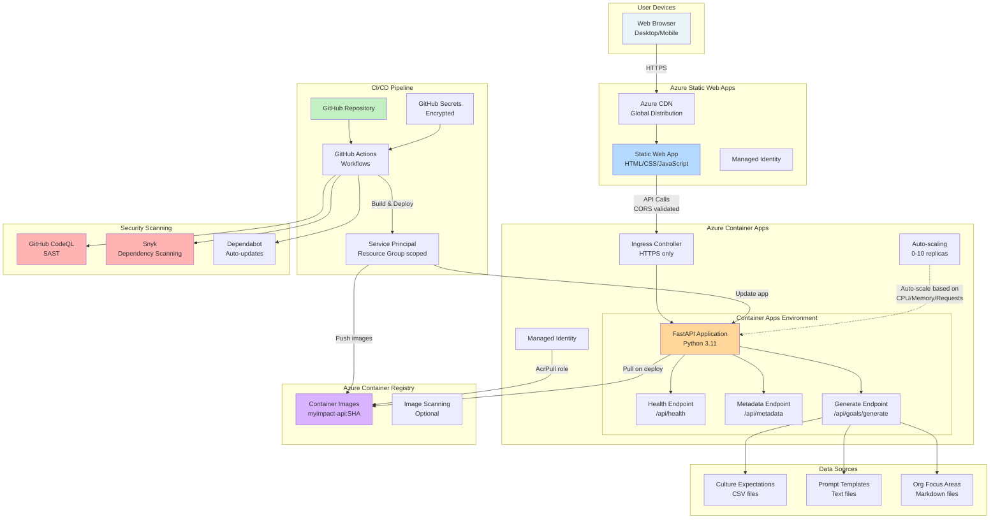
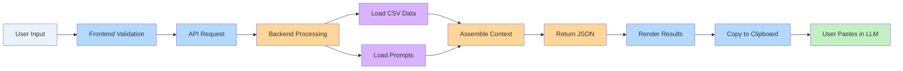
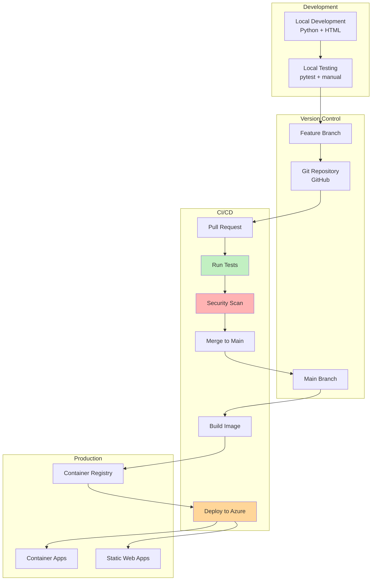

# System Overview

High-level overview of the MyImpact system architecture, components, and interactions.

## Architecture Diagram



## Component Breakdown

### Frontend (Azure Static Web Apps)

**Technology:**
- HTML5, CSS3 (Tailwind CSS via CDN), Vanilla JavaScript
- No build step, no framework dependencies
- Single-page application (SPA)

**Responsibilities:**
- Render landing page and input form
- Validate user inputs (client-side)
- Call backend API (HTTPS/JSON)
- Display results (framework prompt + user context)
- Copy-to-clipboard functionality

**Hosting:**
- Azure Static Web Apps (Free tier)
- Global CDN for low latency
- Automatic HTTPS with Azure-managed certificates
- Custom domain support (future)

**Files:**
- `webapp/index.html` - Single-page app structure
- `webapp/js/app.js` - Main application logic
- `webapp/js/api.js` - API client wrapper
- `webapp/staticwebapp.config.json` - Routing and CORS configuration

### Backend (Azure Container Apps)

**Technology:**
- Python 3.11
- FastAPI web framework
- Uvicorn ASGI server
- Pandas for CSV processing

**Responsibilities:**
- Serve API endpoints (health, metadata, generate)
- Load and parse culture expectations data
- Assemble framework prompts with user context
- Return structured JSON responses
- Handle errors gracefully

**Endpoints:**
| Endpoint | Method | Purpose | Response |
|----------|--------|---------|----------|
| `/api/health` | GET | Health check for liveness/readiness probes | `{"status": "healthy"}` |
| `/api/metadata` | GET | Return available scales, levels, orgs | `{"scales": [...], "levels": [...]}` |
| `/api/goals/generate` | POST | Generate goal prompt from form data | `{"framework_prompt": "...", "user_context": "...", "metadata": {...}}` |

**Hosting:**
- Azure Container Apps (Consumption plan)
- Auto-scaling: 0-10 replicas (demo), 2-50 replicas (prod)
- CPU/Memory: 0.25 CPU, 0.5 GB memory per replica
- Ingress: HTTPS only, public (demo), private (prod)

**Files:**
- `api/main.py` - FastAPI application entry point
- `myimpact/assembler.py` - Prompt assembly logic
- `myimpact/cli.py` - CLI interface (optional)
- `Dockerfile` - Container image definition

### Data Layer

**Culture Expectations CSV:**
- Location: `data/culture_expectations_individual_contributor_technical.csv`
- Format: CSV with columns: Scale, Level, Strategic_Thinking, Execution_Delivery, Collaboration_Influence, Innovation_Learning
- Access: Read-only, loaded on demand
- Size: ~50 KB (small, no caching needed for demo)

**Framework Prompt Template:**
- Location: `prompts/goal_generation_framework_prompt.txt`
- Format: Plain text with markdown formatting
- Content: SMART goal framework, locus of control principles, output format
- Access: Read-only, static content

**Organization Focus Areas:**
- Location: `prompts/org_focus_areas_demo.md`
- Format: Markdown document
- Content: Strategic initiatives, priorities, technology focus
- Access: Read-only, organization-specific (future: multiple orgs)

### Container Registry (Azure Container Registry)

**Purpose:**
- Store Docker images for backend application
- Versioning: Images tagged by Git commit SHA
- Security: Admin user disabled, Managed Identity for pull access

**Image Lifecycle:**
1. GitHub Actions builds image: `myimpact-api:<commit-sha>`
2. Push to ACR: `myimpactdemoXXXXXX.azurecr.io/myimpact-api:<commit-sha>`
3. Container App pulls image via Managed Identity (AcrPull role)
4. Old images retained for rollback (manual cleanup required)

**Configuration:**
- SKU: Basic (demo), Standard (prod)
- Geo-replication: Disabled (demo), enabled for high availability (prod)
- Webhook: Trigger Container App deployment on new image push (future)

### CI/CD Pipeline (GitHub Actions)

**Workflows:**
1. **Test Backend** (`test-backend.yml`)
   - Trigger: Push to any branch, pull requests
   - Actions: Install dependencies, run pytest, upload coverage report
   - Duration: ~2 minutes

2. **Deploy Backend** (`deploy-backend.yml`)
   - Trigger: Push to `main` (changes in `api/`, `myimpact/`, `Dockerfile`, `pyproject.toml`) OR manual trigger
   - Actions: Build Docker image, push to ACR, deploy to Container Apps, health check
   - Duration: ~5-10 minutes

3. **Deploy Frontend** (`deploy-frontend.yml`)
   - Trigger: Push to `main` (changes in `webapp/`) OR manual trigger
   - Actions: Build static site, deploy to Azure Static Web Apps
   - Duration: ~3-5 minutes

**Secrets:**
- `AZURE_CREDENTIALS` - Service Principal credentials (JSON)
- `AZURE_RESOURCE_GROUP` - Resource group name
- `AZURE_REGISTRY_LOGIN_SERVER` - ACR login server
- `CONTAINER_APP_NAME` - Container app name
- `CONTAINER_APPS_ENV` - Container Apps environment name

### Security Scanning

**GitHub CodeQL:**
- Trigger: Weekly scans, pull request scans
- Language: Python
- Purpose: Static Application Security Testing (SAST)
- Reports: GitHub Security tab, pull request comments

**Snyk:**
- Trigger: Daily scans, pull request scans (requires `SNYK_TOKEN`)
- Scope: Python dependencies (`requirements.txt`)
- Purpose: Software Composition Analysis (SCA)
- Severity threshold: High (blocks PR merge)

**Dependabot:**
- Trigger: Daily dependency checks
- Scope: Python dependencies, GitHub Actions versions
- Purpose: Automated dependency updates
- Configuration: `.github/dependabot.yml`

## Data Flow Summary



## Deployment Architecture



## Scaling Strategy

### Frontend Scaling
- **Horizontal:** Azure CDN serves static files globally (automatic)
- **Vertical:** Not applicable (static content)
- **Cost:** Free tier (5 GB storage, 100 GB bandwidth/month)

### Backend Scaling
- **Horizontal:** Auto-scale replicas based on:
  - HTTP requests per replica (target: 100 concurrent)
  - CPU utilization (target: 70%)
  - Memory utilization (target: 80%)
- **Vertical:** Fixed per replica (0.25 CPU, 0.5 GB memory)
- **Scale limits:** 
  - Demo: 0-10 replicas (scale to zero when idle)
  - Prod: 2-50 replicas (min 2 for high availability)

### Database Scaling
- **Current:** No database (stateless application)
- **Future:** Azure Cosmos DB or PostgreSQL for user data persistence

## Cost Model

**Demo Environment (Low Usage):**
| Component | SKU | Monthly Cost |
|-----------|-----|--------------|
| Azure Static Web Apps | Free | $0 |
| Azure Container Apps | Consumption (avg 1 replica, 10% utilization) | ~$5 |
| Azure Container Registry | Basic | $5 |
| Azure Container Apps Environment | Consumption | ~$5 |
| **Total** | | **~$15/month** |

**Production Environment (Moderate Usage):**
| Component | SKU | Monthly Cost |
|-----------|-----|--------------|
| Azure Static Web Apps | Standard (custom domain, SLA) | $9 |
| Azure Container Apps | Consumption (avg 3 replicas, 50% utilization) | ~$50 |
| Azure Container Registry | Standard (geo-replication) | $20 |
| Azure Container Apps Environment | Consumption | ~$15 |
| Azure Monitor/Application Insights | Pay-as-you-go (5 GB/month) | ~$10 |
| **Total** | | **~$104/month** |

**Cost Optimization:**
- Scale to zero during idle periods (Container Apps Consumption plan)
- Use Azure CDN for static content (reduce origin requests)
- Compress API responses (reduce bandwidth)
- Cache CSV data in memory (reduce disk I/O, future)

## Monitoring and Observability

**Health Checks:**
- Liveness probe: `GET /api/health` (kills unhealthy replicas)
- Readiness probe: `GET /api/health` (removes from load balancer until ready)

**Metrics:**
- Request rate (requests/second)
- Response latency (P50, P95, P99)
- Error rate (4xx, 5xx)
- Replica count (current, min, max)
- CPU/Memory utilization

**Logging:**
- Application logs: FastAPI structured JSON logs
- System logs: Container Apps infrastructure logs
- Audit logs: Azure AD activity logs (Managed Identity usage)

**Alerting (Future):**
- High error rate (>5% 5xx errors for 5 minutes)
- High latency (P95 >5 seconds for 5 minutes)
- Replica restart loops (>3 restarts in 10 minutes)
- Failed health checks (>5 consecutive failures)

## Disaster Recovery

**Backup Strategy:**
- Code: Git repository (GitHub) with full history
- Data: CSV files in source control (no separate backup needed)
- Container images: ACR retention (manual cleanup, keep last 10 versions)

**Recovery Objectives:**
- Recovery Time Objective (RTO): 15 minutes (redeploy from last known good image)
- Recovery Point Objective (RPO): 0 (stateless application, no data loss)

**Rollback Procedure:**
1. Identify last known good Git commit SHA
2. Re-deploy Container App with previous image tag:
   ```bash
   az containerapp update \
     --name myimpact-demo-api \
     --resource-group myimpact-demo-rg \
     --image myimpactdemoXXXXXX.azurecr.io/myimpact-api:<previous-sha>
   ```
3. Verify health check passes
4. Notify users of rollback

## Future Enhancements

**Phase 2 (Production-ready):**
- Private VNET for Container Apps (no public ingress)
- Azure Key Vault for secrets management
- Application Insights for distributed tracing
- Web Application Firewall (WAF) for DDoS protection

**Phase 3 (Enterprise-ready):**
- Azure AD authentication for frontend (user login)
- User data persistence (Azure Cosmos DB or PostgreSQL)
- LLM integration (Azure OpenAI API)
- Multi-tenancy (organization isolation)
- Advanced monitoring (custom dashboards, SLOs, error budgets)

## References

- [Azure Static Web Apps Documentation](https://learn.microsoft.com/azure/static-web-apps/)
- [Azure Container Apps Documentation](https://learn.microsoft.com/azure/container-apps/)
- [Azure Container Registry Documentation](https://learn.microsoft.com/azure/container-registry/)
- [FastAPI Documentation](https://fastapi.tiangolo.com/)
- [Azure Well-Architected Framework](https://learn.microsoft.com/azure/well-architected/)
